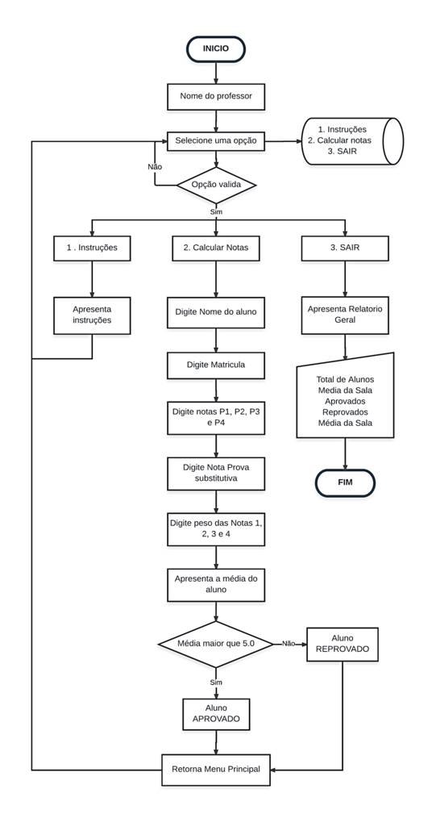
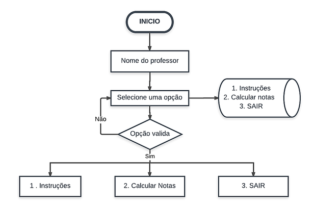
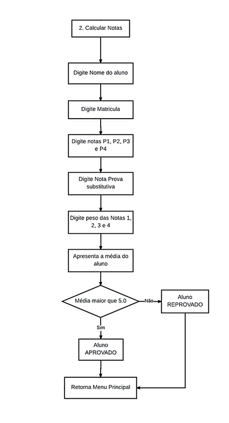

# CalcNotaPIM
Foi desenvolvido esse projeto na UNIP, enquanto cursava ADS, de um software para cadastro de notas que atende a alguns requisitos como cálculos de notas, cadastro de nome, matrícula de notas de alunos e um relatório final geral com todas as médias. A seguir, segue-se toda documentação do projeto.

## NECESSIDADES DO CLIENTE
Com o aumento de alunos, a complexidade e a demora em fazer todos os cálculos manualmente de todos, o professor viu a necessidade do desenvolvimento de um Software para cadastros das notas, que será abordado a seguir.

## ESPECIFICAÇÕES DO PROGRAMA
O programa necessita ser leve para que não haja problemas durante a execução do mesmo. Para isso foi escolhido a Linguagem C para o desenvolvimento do mesmo. Além disso, o programa precisa:
-	Registrar as notas de quatro provas (P1, P2, P3 e P4), além de uma prova substitutiva (para substituir a menor nota).
-	Calcular a média de cada um dos alunos, que é igual à média ponderada das quatro provas. 
-	Caso a média seja inferior a 5.0, o aluno é reprovado.
-	Cadastro de alunos: nome do aluno e matrícula.
-	Cadastro de notas: cadastro de notas das provas.
-	Cálculo das médias: calculo da média de cada um dos alunos, depois de todas as notas cadastradas.
-	Relatório de desempenho: Imprimir (em tela) um relatório com o nome de todos os alunos, suas medias e a média da sala.

Entre outras especificações técnicas.

## FLUXOGRAMA
 
Imagem 1

### MENU PRINCIPAL
  
 Imagem 2

Este é o Menu do Software de cadastro de notas, o Menu Principal, nele será possível escolher o que deseja fazer. Apresentando as opções:
1 – Instruções.
2 – Calcular Notas.
3 – Sair (finalizar programa).

As Seguintes telas apresentam a leitura do nome do Professor e o Menu principal:

Imagem 3.1

.png)
Imagem 3.2

### Menu – INSTRUÇÕES
Neste menu são apresentadas instruções básicas de utilização do programa. Foram adicionadas as seguintes instruções:
*“Caro professor, este programa foi feito para lhe auxiliar no calculo das notas de seus alunos, de maneira fácil e simples. Você poderá cadastrar o nome, matricula e notas de seus alunos e obter os resultados de forma organizada.
Por meio deste, poderá:*
  - Registrar as notas de quatro provas (P1, P2, P3 E P4), além de uma prova substitutiva (para substituir a menor nota).
  - calcular a media de cada um dos alunos, que é igual à média ponderada das quatro provas, e depois de todas as notas cadastradas.
  - calcular a media de cada um dos alunos, que é igual à média ponderada das quatro provas, e depois de todas as notas cadastradas.
 - Visualizar relatório de desempenho geral

Passo a Passo: 
1° Digite o nome do aluno
2° Digite o numero de matricula do aluno
3° Registre as notas de cinco provas.
4° Digite o peso de cada nota.
5° Enquanto quiser continuar a registrar mais alunos, escolha a opção 2.
6° Assim que terminar o cadastro de alunos, no menu principal, escolha a opção 3, SAIR, e Poderá então visualizar o relatório de desempenho e finalizar o programa.”
 

Imagem 4

Depois da apresentação das instruções o usuário é redirecionado para o Menu principal.
 
### Menu – CALCULAR NOTAS
 

Imagem 5

Ao selecionar o Menu Calcular Notas, o usuário terá contato com a tela que recebe Nome do Aluno.

Imagem 6

Ao digitar o Nome do Aluno, o usuário deverá adicionar o Número de Matrícula.

Imagem 7

Depois, são solicitadas as notas P1, P2, P3, P4 e da Prova Substitutiva. 

 Imagem 8
 
Em seguida, devem ser adicionados os pesos de cada uma das provas.

Imagem 9

A seguir, é exibido a média, e se o aluno está aprovado ou reprovado.

 
 Imagem 10.1

.png)
Imagem 10.2

Depois da tela de cadastro de alunos, o usuário será direcionado para o Menu Principal novamente. Caso ocorra erro na escolha das opções do Menu, o sistema avisará ao usuário e retornará para o mesmo, conforme segue:

 Imagem 11

### Menu – SAIR
No menu Sair o programa apresentará para o usuário o Relatório Geral com todas as informações da sala e de cada um dos alunos cadastrados, e finalizado, como mostra na tela:

 Imagem 12

## 7. CÓDIGO

### 7.1 Bibliotecas
Utilizando como base as informações sobre linguagem C e programação neste código passadas pela disciplina Linguagem e Técnicas de Programação, as bibliotecas incluídas no código foram:
 
Imagem 13

Biblioteca padrão standard input-output, stdio.h.

Biblioteca <string.h> para manipulação de strings.

Para o uso das funções system() foi incluída a biblioteca <stdlib.h>  e a seguinte estrutura no inicio da função main:

 Imagem 14
 
 
### 7.2 Comandos
No Menu foi utilizado o comando Switch, como mostra no exemplo a seguir:
 
Imagem 15.1

 .png)
Imagem 15.2

Houve a utilização do comando if e else no código muitas vezes, uma delas foi na tela de média do aluno. Quando a média do aluno era menor que 5,0 aparecia uma mensagem, caso contrario outra. 

 Imagem 16

### 7.3 Funções
Neste programa foi usado de muitas funções para a melhor organização e eficiência do mesmo, como vemos na tela a seguir: 
 
Imagem 17

## 8. CONCLUSÃO
No decorrer do trabalho nos deparamos com a necessidade do professor do Ensino Fundamental desenvolver um software para cadastro de notas que atendesse a alguns requisitos como cálculos de notas, cadastro de nome, matrícula de notas de alunos e um relatório final geral com todas as médias.

 Para que pudesse atender as necessidades da empresa, a aluna Eduarda utilizou técnicas, informações e conhecimentos transmitidos através das aulas de Engenharia de Software I e Linguagem e Técnicas de Programação para criar um programa Leve e que atendesse todos os requisitos com qualidade e eficiência, utilizando-se da Linguagem C.
 
Pudemos ainda acompanhar o funcionamento do programa através de telas e ainda alguns comandos utilizados para a criação do mesmo. 

